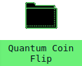

# Shortcut
This section covers the **Shortcut** component, its use, and capabilities.

<figure markdown="span">
  
  <figcaption>Shortcut component loaded with details</figcaption>
</figure>

***
## Purpose
***
Shortcut is the "icon" that shows on the desktop.

It can be moved on both mobile and desktop.

Once clicked (or tapped), the connected Application will open.

Currently, only one instance of an Application can be opened - clicking the Shortcut multiple times will **not** resort in multiple opened windows.

***
## Usage
***
Referencing the [futurist.io](https://futurist.io) website, Shortcuts are loaded from a [ShortcutContainer](shortcutcontainer.md), which expects an array of values that are passed to create the Shortcuts.

Shortcut expects the following to be passed:

* **width**: The starting width of the window
* **icon**: A url to the icon
* **name**: The name shown for the icon
* **action**: The function to open the window.

It is standard to implement Shortcut through a ShortcutContainer.

Using a ShortcutContainer, the above parameters are done for you.

Reference [ShortcutContainer](shortcutcontainer.md) for more information and examples.