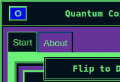

# Tab
This section covers the **Tab** component, its use, and capabilities.

<figure markdown="span">
  { width="300" }
  <figcaption>Show an active Tab (Start) and inactive Tab (About)</figcaption>
</figure>

***
## Purpose
***
Tab is used to alternate between displayed content.

Similar to [Shortcuts](shortcut.md) and [ShortcutContainers](shortcutcontainer.md), 
Tabs are primarily used within a [TabContainer](tabcontainer.md).

***
## Usage
***

For usage, view the [TabContainer](tabcontainer.md)