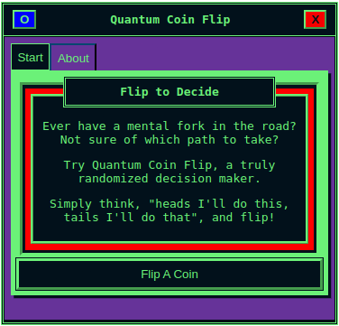

# WindowSpacing
This section covers the **WindowSpacing** component, its use, capabilities, and style variations.

<figure markdown="span">
  { width="300" }
  <figcaption>WindowSpacing component is highlighted in red</figcaption>
</figure>

***
## Purpose
***
```WindowSpacing``` is an actionable interaction for users, just like your standard HTML button.

The WindowSpacing component receives and acts upon a function, defined as an action, and references a set of values.

***
## Usage
***
WindowSpacing expects the following to be passed as parameters:

* **label**: The text label for the button.
* **action**: The onClick for the button.
* **value**: The value to be referenced within the onClick.

Reference the **Core Example** to see basic usage.

This will create a button, a function on which it interacts, and a value which it uses in the function.

***
## Core Example
***
```
import Button from 'futurist-components';

function App() {
    let count = 0;
    function increaseCount(value) {
        count += value;
    }
    return (
        <>
            <Button label="click me" action={increaseCount} value={1} />
            <br />
            <span>The count is: {count}</count>
        </>
    )
}
```

***
## Advanced Usage
***
```Button``` includes additional parameters for theme variations and alternately accessible parameters from the button.

***
## Optional Styles
***
By passing the **variant** parameter, styling can change.

There are two variations:

* **default**: Automatically referenced.
* **inverted**: A separate theme styling.

An example of usage would be similar to the **Core Example** but with the extra parameter passed:

```
<Button label="click me" action={increaseCount} value={1} variant="inverted" />
```
***
## Optional Parameters
***