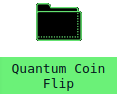
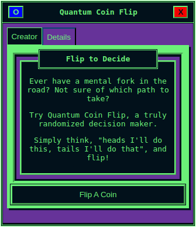

# App Walkthrough
This section assists in understanding the inner workings Applications by talking through an example Application.
***
## Introduction
***

Applications in futurist are awesome, and being able to rapidly build them for various purposes is a primary focus for the project as a whole.

Many of the original Apps were purpose-built, with one of the author's favorites being a truly randomized binary choice assistant.

??? "What do you mean 'truly randomized choice assistant'?"

    Frequently throughout the author's childhood, flipping a coin was the way we decided things to do - ice cream or the park, etc.

    Carrying the habit into my adulthood, questions regarding the authenticity of flipping a coin arose.

    The US Quarter, for example, has been through numerous iterations for the "tails" side, leaving the possibility open for weight distribution.

    This ended up being the case. Not only does weight distribution impact the assumed 50/50 choice, but people (physisists) have trained themselves on consistently flipping the same side of a coin multiple times in a row.

    This shattered a part of my childhood. Was my dad capable of manipulating the outcome for his own personal gain?

    Something needed to be done, which became Quantum Coin Flip. It does use quantum mechanics and does provide a true 50/50 choice.

    To save space in this already long note, Quantum Random Number Generators exist, with popular, dedicated devices being ones being small enough to fit in your pocket.

    The "double slit experiment" and its revealing of an observable universe, as well as light being forms of energy, are typically consolidated into these devices, where what is / is not observed is taken into consideration for the randomization.

***
## Setting Up the Application
***

Let's work with ```quantum-coin-flip```. To do this, run the following command:

```git clone https://github.com/ftrst/quantum-coin-flip```

Next, we'll enter the directory and install the dependencies:

```cd quantum-coin-flip && npm install```

Once installed, we can run the project:

```npm dev```

This will bring you to a black screen with a single icon:

<figure markdown="span">
  
  <figcaption>Quantum Coin Flip project started</figcaption>
</figure>

This icon is actually a [Shortcut](../components/shortcut.md). It is movable and can be clicked to launch the Quantum Coin Flip Application.

***
## File Topography
***

Now that the Application is running, here's an overview of the file structure.

```
Quantum-Coin-Flip
-- src
---- App.css
---- App.jsx
---- index.css
---- main.jsx
---- components
------ QuantumCoinFlip.jsx
------ files
----------- RandomText.jsx
---- states
------ deviceDetail.js
------ deviceDetailState.js
```

Each Application is a self-contained project, which is why it can run without being connected to [futurist-core](/core.md).

The files to make this happen are:

```commandline
Quantum-Coin-Flip
-- src
---- App.css
---- App.jsx
---- index.css
---- main.jsx
```

***
## Starting the Application
***

The ```main.jsx``` is the starting point for the project. It looks like this:

```
import { StrictMode } from 'react'
import { createRoot } from 'react-dom/client'

import App from './App.jsx'
import './index.css'

createRoot(document.getElementById('root')).render(
    <StrictMode>
    <App />
  </StrictMode>
)
```

The purpose for this is to load and reference the ```App.jsx``` and default styling.

***
## Working With the Application
***

The ```App.jsx``` is the main file we want to work with.

It looks like this:

```
import { useState } from 'react'
import './App.css'
import QuantumCoinFlip from './components/QuantumCoinFlip'
import {ShortcutContainer} from 'futurist-components';

import { useAtom, useSetAtom } from 'jotai';
import { useDeviceDetail } from './states/deviceDetail';
import { windowManipulatorAtom } from './states/deviceDetailState';

function App() {

  const device = useDeviceDetail();
  const manipulateWindows = useSetAtom(windowManipulatorAtom);

  const shortcuts = [
    {
      icon: 'https://futurist.io/icons/folder.png', 
      title: 'Quantum Coin Flip', 
      id: "qcf",
      windowData: {
        id: "qcf",
        title: "Quantum Coin Flip",
        width: "300px",
        height: "300px"
      }
    }
  ];

  return (
    <>
      <ShortcutContainer device={device} shortcuts={shortcuts} manipulateWindows={manipulateWindows} />
      <QuantumCoinFlip device={device} manipulateWindows={manipulateWindows} />
    </>
  )
}

export default App
```

This loads a few files:

* The **App.css** for additional styling.
* The QuantumCoinFlip app content.
* The [ShortcutContainer](../components/shortcutcontainer.md) to set up the App details.
* [Jotai](https://jotai.org) for state management

Jotai is used to load the standard [states](standard_states) used across Applications.

```useDeviceDetail``` stores the Applications and bounds for the workable space.

```windowManipulatorAtom``` handles the functions to maximize, minimize, close, and resize windows.

Once those are loaded, they are referenced within the App.

The **useDeviceDetail** is referenced to ```device```.

The **windowManipulatorAtom** is referenced to ```manipulateWindows```.

Notice that ```useSetAtom``` is used for the ```windowManipulatorAtom```, this is because we are adding to the state instead of only referencing it.

Next, we have the ```shortcuts``` array. This contains the content required to build a [Shortcut](../components/shortcut.md).

Lastly, the return contains two components:

First, the ```ShortcutContainer```, which expects three values:

* The ```shortcuts``` array.
* The ```device``` reference, which is passed to the Shortcuts.
* The ```manipulateWindows```, which is passed to the Shortctus.

Second, ```QuantumCoinFlip```, which is the core Application that expects:

* The ```device``` reference, so the Application can utilize the information directly.
* The ```manipulateWindows``` reference, to handle the functions for the window.

***
## Opening the Application
***

The [ShortcutContainer](../components/shortcutcontainer.md) contains the functions to move the Shortcut around the screen and open the Application.

QuantumCoinFlip, while loaded from the App.jsx, does not display content unless the ```id``` from the ShortcutContainer is found in the device state.

Once the Shortcut is either clicked or tapped, depending on the device, the id for the Shortcut is added to the device state.

The QuantumCoinFlip looks for a specific id within the device state, and, if found, loads the details to reveal the app.

Once opened, it looks like this:

<figure markdown="span">
  
  <figcaption>Quantum Coin Flip opened</figcaption>
</figure>

***
## Understanding the Application
***

Due to the length of the file, let's look at QuantumCoinFlip.jsx in pieces.

The file in full can be [viewed here](https://github.com/ftrst/quantum-coin-flip).

***
## Reviewing the Imports
***
First, the imports:

```
import React, { useState, useEffect, useRef, useCallback, useMemo } from 'react'
import styled, { css } from 'styled-components';
import {
    BaseWindow,
    TabContainer,
    Button,
    WindowInset,
    WindowInner,
    WindowSpacing,
    WindowTitle
} from 'futurist-components';

import RandomText from './files/RandomText';
```

* The first line handles standard React imports which are used throughout to reduce re-renders, handle states, etc.
* The **styled-components** is used to pass hard-coded styling to specific components. 

Next, items from futurist-components are imported. This is a component library by futurist to standardize styling and wrap functionality.

By using the styled-components, we can override styling, so there's no limit to the look and feel.

You can read more about the futurist-components here.

Lastly, RandomText loads a file.

***
## Tabs Background
***

As seen in the loaded screenshot, there are two tabs:

* Creator, which loads the main screen with some brief instructions and a button.
* Details, which provides static content.

These tabs are separate components, known as [Tabs](../components/tab.md).

Similar to how Shortcuts are put into a ShortcutContainer, Tabs are put into TabContainer.

***
## About the Tabs
***
As mentioned, there are two tabs within this Application that handle the content to be displayed.

The first tab, Creator, is the more complex of the two.

It has values passed into it from the main function and a conditioning statement to display content depending on whether or not a value (the coin flip) is not null.

The second tab, Details, is simple, only displaying static content.

Both tabs are wrapped with styling components from futurist-components.

Reviewing the tabs, Creator will focus on the functions and Details will focus on the referenced styling components.

***
### Creator Tab
***
Let's go through the Creator tab first.

```
// Define tab content components
const CreatorTab = ({ quantumCollect, selectedValue, flipAgain }) => {
  console.log("Selected value is:", selectedValue);
  return (
    <>
      {selectedValue ? (
        <>
          <Button action={flipAgain} label="Flip Again" />
          <WindowInset>
            <WindowSpacing>
              <WindowInner>
                <>
                  <div>
                    {selectedValue !== "" && (
                      <RandomText choice={selectedValue} />
                    )}
                  </div>
                </>
              </WindowInner>
            </WindowSpacing>
          </WindowInset>
        </>
      ) : (
        <>
          <WindowInset>
            <WindowSpacing>
              <WindowInner>
                <WindowTitle value="Flip to Decide"></WindowTitle>
                {!selectedValue && (
                  <>
                    <div>
                      <p>
                        Ever have a mental fork in the road? Not sure of which
                        path to take?
                      </p>
                      <p>
                        Try Quantum Coin Flip, a truly randomized decision
                        maker.
                      </p>
                      <p>
                        Simply think, "heads I'll do this, tails I'll do that",
                        and flip!
                      </p>
                    </div>
                  </>
                )}
              </WindowInner>
            </WindowSpacing>
          </WindowInset>
          <Button
            label="Flip A Coin"
            action={quantumCollect}
            style={css`
              width: 100%;
            `}
          />
        </>
      )}
    </>
  );
};
```

Three values are passed into the Creator tab:

* [quantumCollect](#quantumcollect-function), a function set up later in the code
* [flipAgain](#flipagain-function), a function set up later in the code
* selectedValue, a state set up later in the code

We'll take a look at those after they are loaded within the QuantumCoinFlip.

In the return for the CreatorTab, we first do a conditional statement to see whether or not the selectedValue is set.

The default value for selectedValue is false, which represents the visual in the screenshot.

Notice the [Button component](../components/button.md) in the code. The style is overridden to make the width 100% of the window.

***
### Details Tab
***
This tab is much simpler. It does not have any values passed to it, has no conditions, and only displays static text.

Let's take this opportunity to go through the components used.

But first, the code:

```
const DetailsTab = () => (
    <>
        <WindowInset>
            <WindowSpacing>
                <WindowInner>
                    <WindowTitle value="Why Use Quantum?"></WindowTitle>
                    <div style={{maxHeight: "20em", overflowY: "scroll"}}>
                        <p>Did you know the weight distribution of a US quarter favors the saying "tails never fails"?</p>
                        <a href="https://www.ripleys.com/weird-news/coin-toss-or-not/"><p>Or how physicists have trained themselves to consistently flip the same result 10 times in a row?</p></a>
                        <p>In the case of asking the universe for a recommendation, randomness is key, and neither of those seem very random.</p>
                        <p>QCF is an app which creates a binary output (heads or tails) based on the sum of numbers.</p>
                        <p>The numbers are generated through a theoretical concept of quantum physics, rather than a typical Quantum Random Number Generator.</p>
                    </div>
                </WindowInner>
            </WindowSpacing>
        </WindowInset>
    </>
);
```

Here's an overview of the components:

* [WindowInset](../components/windowinner.md)
* [WindowSpacing](../components/windowspacing.md)
* [WindowInner](../components/windowinner.md)
* [WindowTitle](../components/windowtitle.md)

The last bit is a standard div.

***
## The Main Function
***

Let's go through the functions.

***
### flipAgain Function
***

This is relatively simple:

```
async function flipAgain() {
    console.log("Running flip again");
    setSelectedValue('');
    await quantumCollect();
}
```

It:
* resets the selectedValue to the default
* runs the quantumCollect function again

***
### quantumCollect Function
***
This function reaches out to an external endpoint.

The external endpoint connects to the server providing the Quantum Randomized Numbers.

The code would need to be hosted by you, or used directly.

The code to host it directly [can be found here](https://github.com/ftrst).

```
async function quantumCollect() {
  try {
    let url = "https://futurist.io/quantum";
    const response = await fetch(url);
    if (!response.ok) {
      throw new Error(`HTTP error!`);
    }

    const data = await response.json();
    console.log("Response data:", data);

    const series = data.data;

    if (!Array.isArray(series)) {
      throw new Error("Response did not include an array.");
    }

    const sum = series.reduce((acc, num) => acc + num, 0);

    const sumOf = sum % 2 === 0 ? "heads" : "tails";

    console.log("The sum of things is:", sumOf);

    if (sumOf == "heads") {
      setSelectedValue("heads");
    } else if (sumOf == "tails") {
      setSelectedValue("tails");
    } else {
      setSelectedValue("");
    }

    return;
  } catch (error) {
    console.error("Fetch error:", error);
    return "Error";
  }
}
```

The code receives an array of 10 numbers, randomly generated using quantum mechanics.

For the binary choice, it's simple. If the 10 numbers are even, "heads" is chosen. If odd, then "tails".

After selected, the selectedValue is updated with either heads or tails.

***
## Tab Components
***
Now we use one of our React imports, ```useMemo```.

This helps us reduce re-renders and creates a structured dataset for our tabs.

```
const tabComponents = useMemo(
  () => ({
    Creator: () => (
      <CreatorTab
        quantumCollect={quantumCollect}
        selectedValue={selectedValue}
        flipAgain={flipAgain}
      />
    ),
    Details: () => <DetailsTab />,
  }),
  [selectedValue, quantumCollect, flipAgain],
);
```

The label for the tab, is the first part of the data structure.

!!! note "Keep in mind"

    Each of the required imports for the tabs is within the array!


```
return (
  <>
    {windowDetails && (
      <>
        <BaseWindow
          key="1"
          id="qcf"
          device={device}
          manipulateWindows={manipulateWindows}
        >
          <TabContainer tabComponents={tabComponents} />
        </BaseWindow>
      </>
    )}
  </>
);
```

***
## Export Function
***

This is it!
```
export default QuantumCoinFlip
```