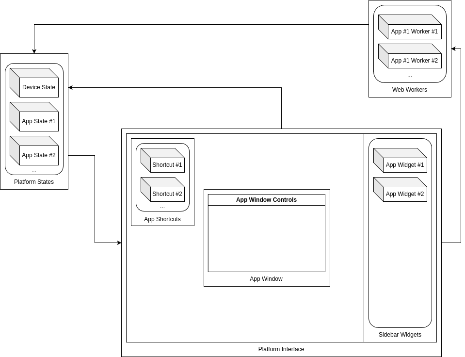

# Platform Architecture
This section discusses in brief the core concepts, their roles, and purpose.

***
## Introduction
***
Futurist is written primarily in Javascript.

To maximize customization and scalability, futurist was divided into three parts (Core, Sidebar, and Applications) and a state management framework.

The three parts are maintained separately within their own respective repos.

A visual example of the architecture is below:

<figure markdown="span">
  { width="300" }
  <figcaption>Futurist architecture and sample event cycle</figcaption>
</figure>

With state standardization, different components, such as the core and sidebar, can access the state, as well as one or multiple applications, simultaneously.

***
## Futurist Template
***
Futurist has a pre-built template, which is the best way to start working with futurist.

It is built from Core and Sidebar, has an Application, and uses a Standard State.

All of this you can read more about it below.

To get started with the template, check out the [Setup Guide](../setup_guide/quick_start.md).

***
## Core
***
Core handles the following:

* Interaction with opening / closing Sidebar
* Interactions with dragging Shortcuts
* Interactions with opening / closing Applications
* Event listeners for window-specific details (such as current height / width)
* Interface for Applications

Core has a dedicated repo: [futurist-core](https://github.com/ftrst/futurist-core)

***
## Sidebar
***
Currently, Sidebar includes static content that can be customized directly from the repo.

For future, Sidebar is expected to maintain Widgets, a micro version of Applications.

Sidebar has a dedicated repo: [futurist-sidebar](https://github.com/ftrst/futurist-sidebar)
***
## Applications
***
Applications are both aesthetically and functionally wrapped projects.

They can include their own dedicated state, as well as access states of existing projects.

The [Component Library](../components/overview.md) handles much of the complexity and creates a standard for capabilities, etc.

There's numerous [App Examples](../development/example_apps.md) to review for anyone to use, remake, extend, and reference for new Applications.

To see a full walkthrough of an Application, its setup, and how it works, check out the [Application Walkthrough](app_walkthrough.md).

***
## States
***
Not specific to futurist, States are values that can be referenced across parts of a project.

Under the hood, futurist States are [managed by Jotai](https://github.com/pmndrs/jotai), a primitive state management framework.

Generally, States are meant to be cross-referenced by separate Applications and / or Core.

There are two different types of States: 

* [Standard States](standard_states.md) are ones that are created for the Framework.
* [Custom States](custom_states.md) are ones that are built for Applications.